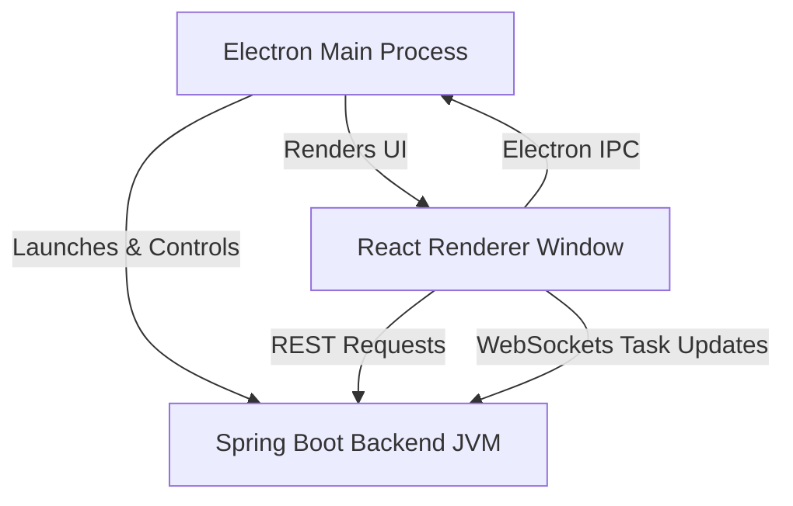

# Technical Specification - File Organizer

## 1. System Architecture

The application is structured as a standalone offline-first desktop application using a hybrid multi-process model:



- **Frontend Client**: React Single Page Application (SPA) styled with Tailwind CSS, embedded in an Electron shell wrapper.
- **Backend Service**: Spring Boot standalone application powered by Java 21, running locally on port `8080`.
- **Database Engine**: SQLite local relational database using Write-Ahead Logging (WAL) mode for concurrent access support.

---

## 2. Concurrency & Write Queueing

To prevent SQLite database lock collisions (`SQLITE_BUSY`) during rapid concurrent writes, all database modification queries are routed through a centralized write queue:

```java
public class SqliteWriteQueueService {
    private final ExecutorService writerExecutor = Executors.newSingleThreadExecutor();
    
    public <T> Future<T> submitWrite(Callable<T> writeAction) {
        return writerExecutor.submit(writeAction);
    }
}
```

This ensures that only a single thread ever writes to the SQLite file at any given moment, serializing disk access while reads remain concurrent.

---

## 3. Storage & Local Cache

- **Preferences Directory**: All user preference maps (such as layout rules) are serialized into `preferences.json` in the local directory:
  `%USERPROFILE%/AppData/Local/e-abhilekh/preferences.json`
- **Cache Management**:
  - `reports/`: Diagnostic JSON details of completed scans and operations.
  - `temp/`: Temporary directories for decrypting files for previewing.
  - `logs/`: Logback trace files.
- **In-Memory Caching**: Redis-like local caching abstraction is implemented in `RedisCacheService.java` to buffer frequently read file attributes.
